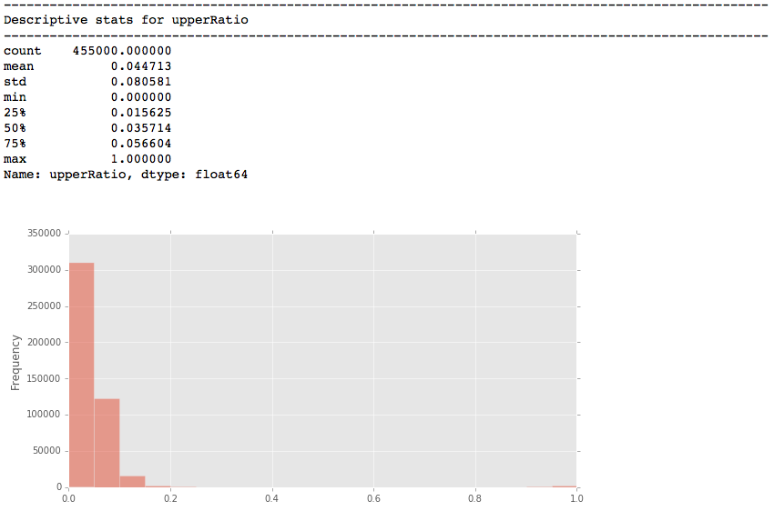
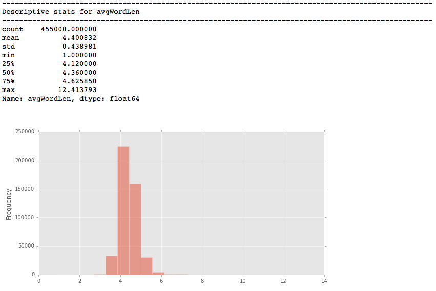

#### Assignment 1: Machine Learning Classification

---------
#####Final Model: Classification-updated-v3-FINAL
* Results, Report & Visualizations of final model in Jupyter Notebook
* Model: Stochastic Gradient Descent / Logistic Regression
* Binary Classifier
* Dataset: Amazon reviews
* Task: Predict if a review will be helpful

#### Classification results from final model

## The model:

##### Hashing Vectorizer - Bag of Words:

##### Stochastic Gradient Descent / Log Loss Function:

## The model's performance on the test data:

##### ROC plot & Confustion Matrix:

##### Evaluation measures:

##### Confusion Matrix:

## The model's performance on the train data:

##### ROC plot & Confustion Matrix:

##### Evaluation measures:

##### Confusion Matrix:

---------

#### Initial classification results from model_1.py

### Model 1 / take 1 / Logistic Regression

The original Amazon dataset contains (455000, 13) samples

The features for this model are derived from a Bag of Words and additional parsing of the text of the review and dataset. The final dataframe contains (455000, 131088) samples x features as a sparse matrix.

The features I added besides the bag of words are:

|  featureName        |  feature |
|---------------------|----------|
|   nWords            | Number of words |
|   nChar             | Number of characters |
|   wordCharRatio     | Ratio between words and characters |  
|   nUpper            | Number of Uppercase letters |
|   upperRatio        | Ratio of upper to lowercase |
|   longestWord       | Longest word |
|   avgWordLen        | Average word length |
|   exclamationPoint  | Exclamation points number |  
|   punctCount        | Punctuation count |
|   punctRatio        | Ratio of punctution to characters |
|   nReviewsProducts  | Number of reviews for the product |
|   nReviewsRatio     | Ratio of number of reviews to product |
|   nRepeatUsers      | Number of users who left more than one review |
|   nUniqueUsers      | Number of unique users |
|   score				  | score |
|   time				  | time |

## The model's peformance on the test data:

##### ROC plot:

##### Confustion Matrix & Report:

##### Measures:

##### Confusion Matrix Image:

## The model's peformance on the train data:

##### ROC plot:

##### Confustion Matrix & Report:

##### Measures:

##### Confusion Matrix Image:

## The model's peformance on the test data without the bag of words:
I though it very curious how the model performs sans the BOW

##### ROC plot:

##### Confustion Matrix & Report:

##### Confusion Matrix Image:

# Distribution, historgam, and descriptive stats of features

##### nWords:

##### nChar:

##### wordCharRatio:

##### nUpper:

##### upperRatio:

##### longestWord:

##### avgWordLen:

##### exclamationPoint:

##### punctCount:

##### punctRatio:

##### nRepeatUsers:

##### nUniqueUsers:

##### score:

