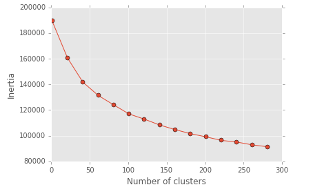
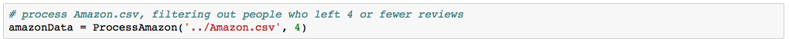
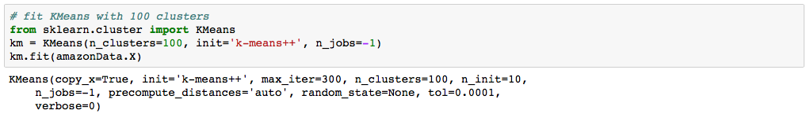
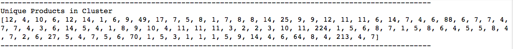
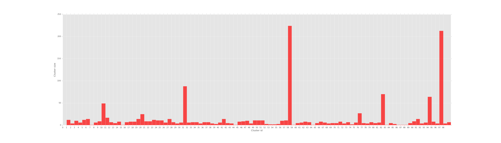

#### Assignment 3: Machine Learning Clustering

---------
#####Final Model: kmeans_amazon-updated-v2-Final
* View clusters_size_final.png for cluster size
* View clusters_final.txt for a sample of the clusters
* Model: KMeans
* Dataset: Amazon reviews
* Task: Amazon recommendation system
* Report is in the Jupyter notebook

#### Clusterung results from final model

##### Inertia:

## The model:

##### Filter:

##### Model:

## The model's performance:

##### Number of clusters: 100

##### Cluster size - Number of unique products:

##### Cluster size - Number of unique products:

##### [Report - sampling unqiue products from clusters](https://github.com/ep866/Machine-Learning/blob/master/clustering/clusters_final.txt)
---------