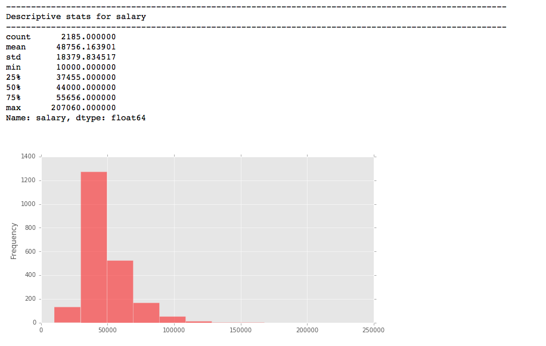
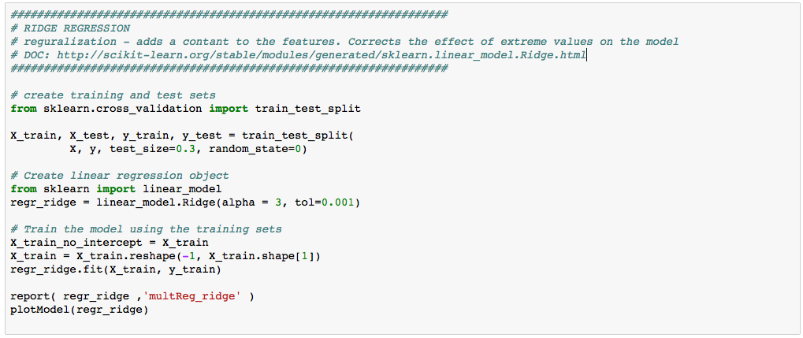
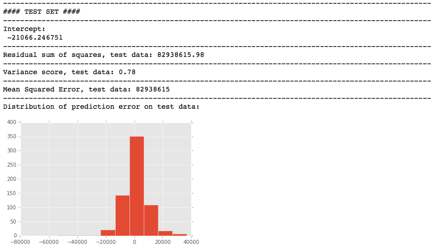
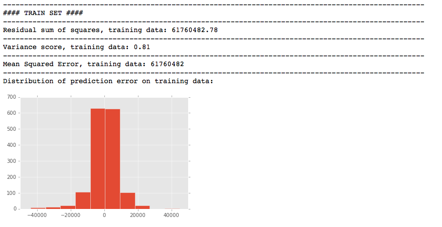
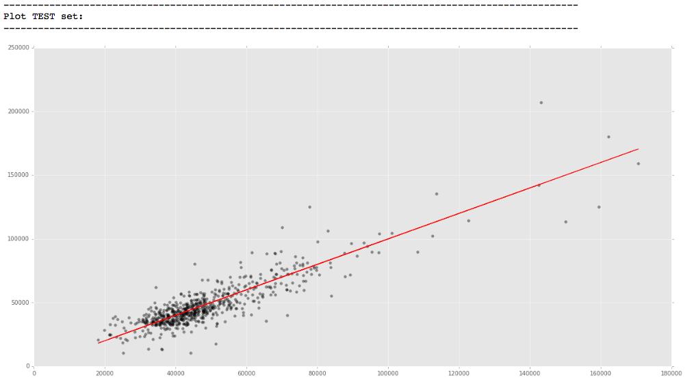
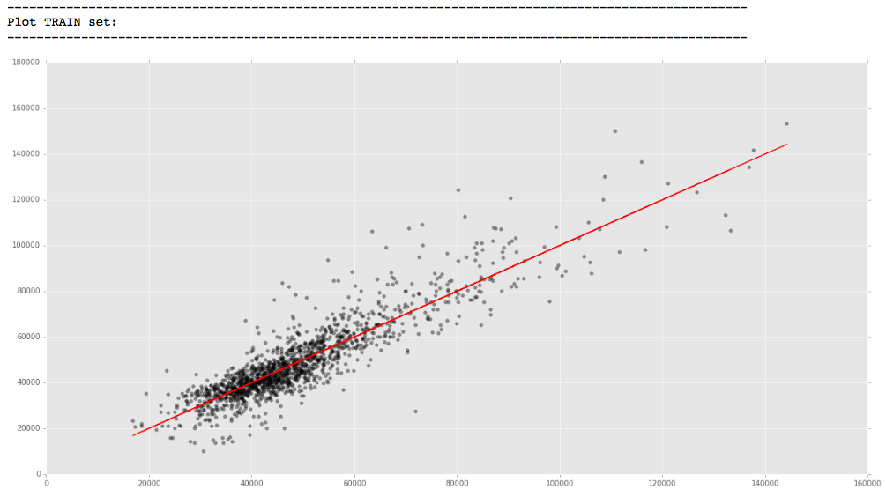

#### Assignment 2: Machine Learning Regression

---------
#####Final Model: regression-updated-v3-Final
* Results, Report & Visualizations of final model in Jupyter Notebook
* Model: Ridge Regression
* Dataset: Salaries
* Task: Predict salary

#### Regression results from final model

##### Descriptive statistics for salary:

## The model:

##### Ridge Regression:

## The model's performance:

##### Evaluation on test data:

##### Evaluation on train data:

##### Predicted versus actual salary test data:

##### Predicted versus actual salary train data:

##### [Report - data frame with errors](https://docs.google.com/spreadsheets/d/1AcxyJxISP2N0wnF0vBPvCOg_iLanty3d0P8WRnwF-MA/edit#gid=0)
---------